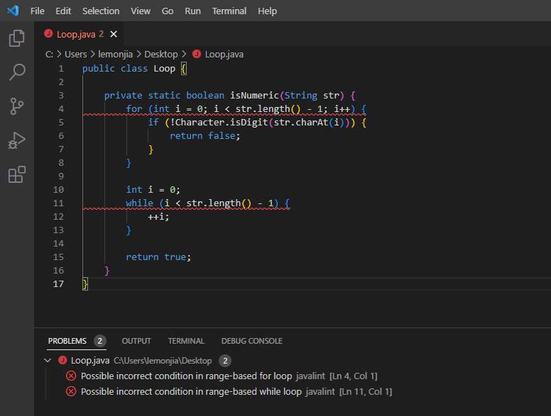

# javalint-vscode

[](https://github.com/devops-lintflow/javalint-vscode/tags)


## Introduction

*javalint-vscode* is a VS Code extension using the javalint checker to provide Java code style checker within
Visual Studio Code, forked from https://github.com/secularbird/cpplint-extension.


## Features




## Requirements

```bash
git clone https://github.com/devops-lintflow/javalint.git
cd javalint
mvn clean install
```


## Install

```bash
yarn
vsce package
vsce publish
```


## Settings

* `javalint.javalintPath`: set javalint library path, path on windows should like `C:\Users\github\devops-lintflow\javalint\target\javalint-latest-shaded.jar`
* `javalint.languages`: set the allowed vscode language identifiers that javalint will check (Currently only on single file mode)


## License

Project License can be found [here](LICENSE).


## Reference

- [publishing-extension](https://code.visualstudio.com/api/working-with-extensions/publishing-extension)
